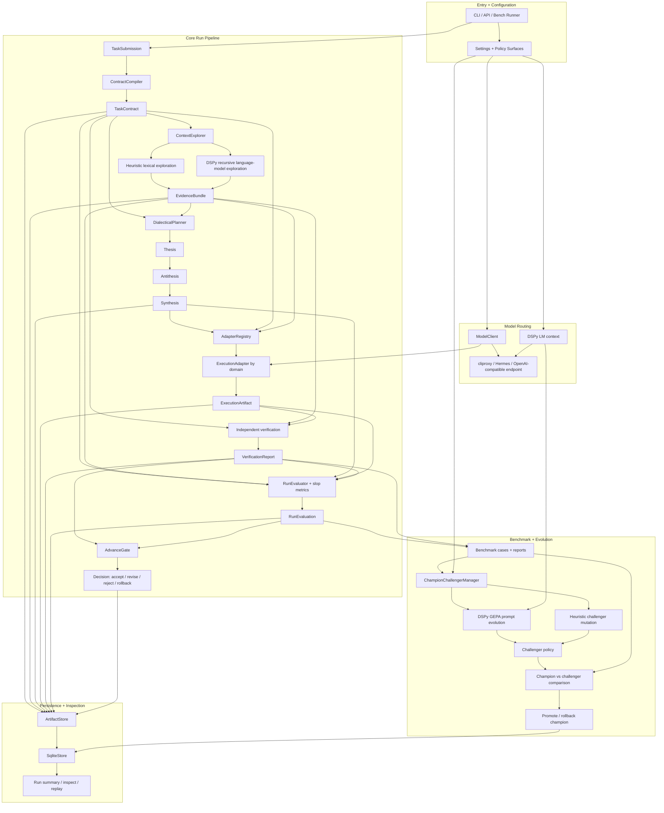

# Autodialectic Reference Flow

This is the reference process map for the full autodialectic system. It is intentionally broader than the current implementation so we can use it as the target shape while tightening each part.

Implementation notes
- `ModelClient` and DSPy should route through the same configured OpenAI-compatible endpoint unless explicitly separated.
- DSPy RLM is the long-context recursive exploration branch, not a plain retrieval pass.
- Dialectics must preserve the full thesis -> antithesis -> synthesis handoff because downstream evaluation depends on objection coverage.
- Verification and evaluation stay independent from execution.
- Champion/challenger evolution only promotes after benchmark comparison and canary protection.
